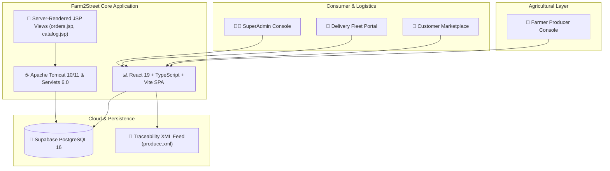

# 🌱 Farm2Street (Farm-to-Doorstep Direct Agri-Tech Platform)

> **Web Technology Laboratory & Capstone Project**  
> Direct Farmer-to-Consumer Produce Marketplace with QR Harvest Traceability, Real-time Delivery, and Supabase Cloud.

---

## 📋 Executive Overview

**Farm2Street** is a hyperlocal agricultural marketplace that connects regional organic farmers directly with urban consumers and street vendors. By eliminating predatory middlemen, farmers earn fair value for their produce (+24% higher realization), and consumers receive verified fresh harvest within hours of morning picking.

### Core Value Propositions:
- 🚜 **Direct Producer Onboarding:** Farmers list crops, set transparent pricing, and receive automated payouts.
- 📦 **8-Stage Live Delivery Lifecycle:** Visual timeline from morning harvest, quality checking, EV cold transit, to doorstep handover.
- 🔍 **Cryptographic Batch Traceability:** Each batch carries an immutable QR code linking to harvest time, soil carbon index, and NPOP organic certification.
- 💳 **Direct Agri-Escrow Checkout:** Integrated Razorpay payments (UPI, Cards, NetBanking) with HMAC-SHA256 signature verification.
- 🗺️ **GIS Geospatial Maps:** OpenStreetMap & Leaflet mapping regional farm clusters and live transit routes without external Google APIs.

---

## 🏛️ System Actors & Architecture

Farm2Street defines **4 Primary Human Actors** and **2 External System Actors**:

| Actor | Classification | Core Responsibilities |
| :--- | :--- | :--- |
| **Farmer** | Human (Producer) | Farm profile management, crop listings, batch harvesting, dispatch sealing. |
| **Customer** | Human (Consumer) | Fresh produce discovery, smart subscription boxes, cart checkout, QR origin audit. |
| **Delivery Partner** | Human (Logistics) | Farm gate pickup, cold-chain monitoring, turn-by-turn routing, last-mile delivery. |
| **Admin** | Human (Governance) | Marketplace audits, farmer KYC verification, escrow settlement approvals. |
| **Razorpay** | External System | Digital payment authorization, webhook signature verification, automated payouts. |
| **Supabase Cloud** | External System | Managed PostgreSQL 16 database, real-time WebSocket events, JWT authentication. |



---

## 🎓 15 Core Web Technology Syllabus Topics

This project is built to satisfy the university **Web Technology (WT) Lab Course Syllabus**:

| # | Syllabus Topic | File Location | Implementation & Code Evidence |
| :-: | :--- | :--- | :--- |
| **1** | **HTML5** | `frontend/index.html`<br>`src/main/webapp/index.html` | Semantic tags (`<header>`, `<nav>`, `<main>`, `<section>`, `<article>`, `<canvas>`, `<footer>`), form validation attributes (`required`, `pattern`). |
| **2** | **CSS3** | `frontend/src/index.css`<br>`src/main/webapp/assets/*.css` | CSS3 Grid, Flexbox, custom variables, `@keyframes` animations (sway, radar, pulse), responsive glassmorphism. |
| **3** | **JavaScript** | `frontend/src/**/*.tsx`<br>`frontend/src/**/*.ts` | ECMAScript 2022+ features: arrow functions, async/await, closures, promises, DOM manipulation, strict TypeScript typing. |
| **4** | **AJAX** | `frontend/src/components/features/TraceabilitySection.tsx` | Asynchronous `XMLHttpRequest` and `fetch()` fetching `produce.xml` and updating DOM dynamically without page refresh. |
| **5** | **XML** | `src/main/webapp/produce.xml`<br>`src/main/java/com/farm2street/controller/TraceabilityXmlServlet.java` | Well-formed XML feed (`produce.xml`), browser `window.DOMParser()` DOM traversal, and servlet XML streaming (`application/xml`). |
| **6** | **JSP** | `src/main/webapp/orders.jsp`<br>`src/main/webapp/catalog.jsp` | Server-rendered pages using JSP 3.1 directives, Expression Language (`${}`), and JSTL tags (`<c:forEach>`, `<c:if>`). |
| **7** | **Servlets** | `src/main/java/com/farm2street/controller/*.java` | Jakarta Servlets 6.0 (`@WebServlet`) handling GET/POST requests, JSON generation via Gson, and session control. |
| **9** | **JDBC** | `src/main/java/com/farm2street/config/DBConnection.java`<br>`src/main/java/com/farm2street/dao/*.java` | Direct SQL connectivity to Supabase PostgreSQL using `org.postgresql.Driver`, `PreparedStatement`, and `ResultSet`. |
| **11** | **Apache Tomcat** | `pom.xml`<br>`src/main/webapp/WEB-INF/web.xml` | Configured for Apache Tomcat 10/11 at port `8080`, generating deployable `farm2street.war`. |
| **12** | **Database** | `schema.sql`<br>`src/main/resources/database.properties` | **Supabase PostgreSQL 16**: Relational schema (`users`, `farms`, `produce`, `orders`), foreign keys, check constraints. |
| **13** | **Cookies** | `src/main/java/com/farm2street/controller/AuthServlet.java`<br>`frontend/src/context/FarmContext.tsx` | Server cookies via `Cookie rememberCookie = new Cookie(...)` and client-side `document.cookie` with 30-day max-age. |
| **14** | **Sessions** | `src/main/java/com/farm2street/controller/AuthServlet.java`<br>`src/main/webapp/WEB-INF/web.xml` | Server-side `HttpSession` with 30-minute timeout (`<session-timeout>30</session-timeout>`) and client `sessionStorage`. |
| **15** | **Web Testing Tools** | `src/test/java/com/farm2street/test/Farm2StreetSeleniumTest.java` | 8 automated test cases using **Selenium WebDriver 4.20** and **JUnit 5** with headless Chrome browser automation. |

---

## 🗄️ Database Setup (Supabase PostgreSQL 16)

1. Open your **Supabase Dashboard** (`https://supabase.com/dashboard/project/aydjkpolejhsmpsrmgfo`).
2. Click **SQL Editor** on the left menu (the `>_` icon).
3. Open [`schema.sql`](schema.sql) from the root of this project.
4. Copy all contents, paste into the Supabase SQL editor, and click **Run**.
5. All 4 relational tables (`users`, `farms`, `produce`, `orders`) will be created with constraints and initial data.

---

## 🚀 Running the Project

### Option A: Modern Web Development (Vite + React)
```bash
cd frontend
npm install
npm run dev
```
Open **`http://localhost:5173`** in your browser.

### Option B: Apache Tomcat 10/11 Deployment (Java EE / JSP)
1. Build the project:
   ```bash
   mvn clean package
   ```
2. Copy `target/farm2street.war` into your Tomcat `webapps/` folder.
3. Start Tomcat and navigate to:
   - Platform: `http://localhost:8080/farm2street/`
   - JSP Orders Log: `http://localhost:8080/farm2street/orders.jsp`
   - JSP Produce Catalog: `http://localhost:8080/farm2street/catalog.jsp`
   - XML Traceability Feed: `http://localhost:8080/farm2street/produce.xml`
   - Servlet API: `http://localhost:8080/farm2street/api/produce`

---

## 🧪 Automated Testing Suite (Selenium WebDriver)

Run the automated Selenium browser test suite with JUnit 5:
```bash
mvn test -Dtest=Farm2StreetSeleniumTest
```

### Verified Test Cases:
| Test ID | Method Name | Tested Technology |
| :---: | :--- | :--- |
| **TC01** | `testHomePageTitleAndHeader()` | HTML5 Title, Semantic Body & Header |
| **TC02** | `testHtml5CanvasAndInteractiveElements()` | HTML5 2D Canvas & Dynamic DOM |
| **TC03** | `testXmlFeedEndpoint()` | XML Feed Structure & Origin Tags |
| **TC04** | `testJspOrdersPageRendering()` | JSP 3.1 & JSTL Orders Table |
| **TC05** | `testJspCatalogPageRendering()` | JSP & JDBC Produce Catalog |
| **TC06** | `testCookieManagement()` | Cookie Persistence, Expiry & Deletion |
| **TC07** | `testSessionIdHandling()` | Tomcat `JSESSIONID` HttpOnly Security |
| **TC08** | `testProduceServletEndpoint()` | Jakarta Servlet JSON REST Response |

---

## ☁️ Deploying on Render

To deploy Farm2Street on **Render**:

1. Log into **[render.com](https://render.com)**.
2. Click **New +** &rarr; **Static Site**.
3. Configure the build:
   - **Root Directory:** `frontend`
   - **Build Command:** `npm run build`
   - **Publish Directory:** `dist`
4. Add **Environment Variables** in Render's dashboard:
   - `VITE_SUPABASE_URL` = `https://aydjkpolejhsmpsrmgfo.supabase.co`
   - `VITE_SUPABASE_ANON_KEY` = `(your copied Supabase anon key)`
   - `VITE_RAZORPAY_KEY_ID` = `rzp_test_1DP5mmOlF5G5ag`
5. Click **Deploy**. Your app will be live with high-speed CDN and SSL!

---

## 📁 Repository Structure

```
farm2street/
├── frontend/                     # Modern Vite + React 19 Frontend
│   ├── src/
│   │   ├── components/
│   │   │   ├── features/         # Portals, Admin, Traceability, OrderModals
│   │   │   ├── layout/           # Navbar (with FarmLogo), LeftSlideNav, Footer
│   │   │   └── ui/               # Interactive Canvas Hero, 3D Carousel
│   │   ├── context/              # FarmContext (State, Cookies, Sessions)
│   │   ├── data/                 # Seed & mock fallback data
│   │   ├── lib/                  # Supabase PostgreSQL client & helpers
│   │   └── types/                # Strict TypeScript interfaces
│   ├── .env                      # Local environment credentials
│   ├── package.json
│   └── vite.config.ts
├── src/                          # Enterprise Jakarta EE Backend
│   ├── main/
│   │   ├── java/com/farm2street/ # Servlets, DAOs, JDBC Connection Pool
│   │   ├── resources/            # database.properties (JDBC pooler config)
│   │   └── webapp/               # orders.jsp, catalog.jsp, produce.xml, web.xml
│   └── test/java/com/farm2street/# Selenium WebDriver & JUnit 5 test suite
├── pom.xml                       # Maven configuration for Tomcat WAR
├── schema.sql                    # Supabase PostgreSQL DDL & DML tables
└── README.md                     # Master documentation & syllabus guide
```
